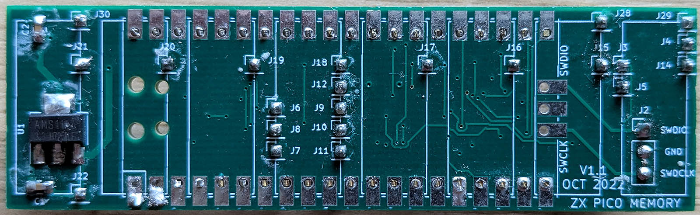

# zx-spectrum-pico-memory

## A Microcontroller-based Lower Memory Implementation for the ZX Spectrum

This project replaces the 16K of lower memory in the ZX Spectrum with a Raspberry Pi Pico2. The RP2350
microcontoller on the Pico is programmed to emulate the original MK4116 DRAM ICs, and responds to reads
and writes from the Z80 CPU and the Spectrum's ULA support chip in the same way the original memory
does. It's not a cycle-perfect implementation, as I'll discuss, and to be honest it's of limited
practical use in this age of cheap SRAM based memory modules. But it was an interesting project, both
from a ZX point of view, and that of pushing the Pico to its limits.

### History

The original work on this project was done by myself and Andrew Menadue in 2022. Andrew designed the board
for the RP2040-based Raspberrry Pi Pico, and that work is still in
<a href="https://github.com/blackjetrock/zx-spectrum-pico-memory">his repository</a>. In late 2022 it
defeated us, the RP2040 just couldn't go fast enough to match 150ns silicon. I picked the project up
again in summer 2025 and had another look at it. Still unable to get it working, I changed it to use
the RP2350-based Pico2, and, that being a faster and more easily overclockable device, was able to
do the task. Just.

## The Technical Challenge

The MK4116 DRAM ICs in the ZX Spectrum provide the machine's lower 16K of RAM (memory locations 0x4000 to
0x7FFF inclusive). This memory area contains the memory used to create the Spectrum's memory mapped
video display (memory area 0x4000 to 0x5AFF inclusive). As such the 16K memory area is used by both the
Z80 CPU and the ULA support chip which is responsible for generating a video display from the memory
area.

The MK4116s used in the Spectrum are rated at 150ns, meaning a single read or write operation will
complete inside 150ns. Although the Z80 doesn't drive the DRAM ICs at their fastest speed, the ULA does.
This is because the ULA was tuned to generate the video image as quickly as possible, thereby not
slowing down the rest of the ZX Spectrum's system. The challenge with this DRAM emulator is to meet the
ULA's speed requirements, as opposed to the much more modest requirements of the Z80.

### Signal Patterns

The MK4116 was designed with a 7 bit address bus to meet physical space requirements and technical
limitations of the day, but to supply 16K of data it needs a 14 bit address bus. The solution to this
problem was to multiplex the address bus. The required 14 bits are sent from the Z80/ULA to the MK4116 in
two phases which make up a grid sort of pattern: the first 7 bits being supplied from the Z80/ULA as the "row"
and the second 7 bits being supplied from the Z80/ULA as the "column". Where the row and column intersect
in the internal MK4116 grid-like store, that's where the required data bit would be read from or written to.

The pattern for the MK4116 emulator to follow is therefore fairly simple: wait for the Row Address Strobe
(RAS) signal to appear, indicating the first 7 bits of the target address are on the address bus, then read
that value and store it. Then wait for the Column Address Strobe (CAS) signal to appear, indicating the
second 7 bits of the target address are on the address bus, then read that value and combine it with the
row value to get the full 14 bit address. Check the WRITE signal to see if the MK4116 should be doing a read
or write, and if it's a write go to the 8 bit data bus to fetch the value being written into the emulated
memory and write it into the Pico's onboard RAM. If the Z80/ULA is doing a read, go and fetch the data byte from
the Pico's onboard memory and put it on the data bus as an output. Once the Z80/ULA's done, go back to the top
and do it again.

The only real complication is that the MK4116 supports a "page mode" which the ULA (but not the Z80)
utilises. This is to support several reads in one go, and runs faster than the normal one-at-a-time mode.
In page mode, the RAS signal (and first 7 bits of the target addresses) are provided, and then the
repeated CAS signals (and associated second 7 bits of the target addresses) are provided one after the
other without ending the original RAS. It's a faster way of reading adjacent MK4116 memory and the ULA uses it to
build the video image as quickly as possible.

### Speed

The MK4116 may be a 1970s design, but it's still presented in silicon, which means it's fast. Not by today's
silicon standards maybe, but by todays CPU standards it is. The RP2040 natively runs at 133MHz, which means
one clock cycle is about 7.5 nanoseconds. The ARM chip runs approximately one instruction per clock cycle (it's
not quite that simple, but it's a rough approximation) which means it can run around 20 instructions in the
150ns access time of the original MK4116. So if the RP2040 was ever going to do everything required of it in
order to produce an accurate emulation, it was going to need to do it in very few instructions.

In pracise, 20 machine code instructions per transaction was never going to be enough to produce an emulation,
even of a simple storage device like the MK4116. Hefty overclocking was always going to be needed. Overclocking
to 270MHz might be fast enough.

It turned out that the RP2040-based Pico just wasn't fast enough. Back in 2022 when this project started I had
a particularly compliant one which overclocked to 360MHz, and that could run fast enough to satisfy the Z80's
requirements, but it was nowhere near fast enough to do the page mode reads the ULA needed. On this basis the
project stalled until 2025 when RP2350-based Pico2s became commonplace. All discussion and timings described
from this point onwards refer to the Pico2.

## Hardware

The hardware board was designed by Andrew Menadue. He did it based on the original Pico, the Pico2 not even
being discussed in 2022. It just fits inside the area of the Spectrum's PCB where the original MK4116s are
installed, and uses a handful of individual header pins to plug into the DRAM sockets.

On the top of the board is a voltage regulator and the Raspberry Pi Pico (the photo above doesn't have the
Pico installed). On the underside, inside the area between the Pico's pins,
are 3 level shifters which convert the Spectrum's +5V signals to the Pico's +3V3 voltage. Input signals from 
the Spectrum, like RAS, CAS and the 7 address lines go through level shifters set to a single direction. The
data bus needs to be reversible, so the Pico can both read and write data byte values. The level shifter
which controls the data bus therefore has a Pico-controllable direction toggle.

It's a 4 layer board, and is still a bit cramped. The current version is too tall when the Pico is installed
on it, preventing the Spectrum's keyboard being fitted back in place. If anyone ever has a practical use for
this device it'll probably need redesigning so as to allow the Spectrum to be reassembled. Consider the
current board to be a functioning prototype.

## Software, and the outstanding issue

The software was the main challenge with this project. When Andrew and I started we worked together, writing
code in C. When it started to hit limitations Andrew branched off and started trying to write parts of the
main loop in ARM assembly language. I stuck with C code. We both managed to produce code which would meet
the speed requirements of the Z80:

You can just about see the (C) 1982 message peering out from that mess.

But despite a lot of effort, neither of us produced code fast enough to make the Spectrum work properly and
the project stalled for 3 years.

When the Pico2 came out, with its faster cores and higher clock speed I picked up the project and had another
look. I added a few optimisatons, but generally the code I tried on the RP2350 was much the same as that which
was failing on the RP2040 3 years earlier. Only, on the RP2350, with a little more tuning, it worked. Just about.

You can see on there are a number of flickering arefacts on the screen. Those are caused by the DRAM emulator
not running quite fast enough to deliver page mode reads to the ULA. Each artefact is the result of a missed
read, the ULA finding essentially random data on its data bus.

The problem is shown on the oscilloscope capture. Yellow is RAS, and that can be seen to go low at the left
side. CAS, in light blue, goes low twice, then RAS goes high again. Those 2 CAS signals indicate 2 data bytes
being read by the ULA, one for pixel data, the other for colour data. That bit works fine. So RAS then goes
high, and then low again. Shortly after RAS goes low the second time (yellow line, centre of the image) CAS
goes high then low again. That's where the ULA is reading the pixel data for the second time, and that's
where the problem is. The gap between RAS going low, and CAS going low, is very tight, about 100ns. At that
point the code needs to spot that RAS has gone low, get the 7 bits of row address from the address bus, then
get back to the top of the loop quickly enough in order to spot that CAS has gone low again. Most times it
can manage it, but just occasionally it misses the CAS. That's when an artefact appears on screen.

So it's not quite good enough to use, and the software can't run any faster. PIOs might be an option to get
a bit more speed out of the emulator. Other than that we need to wait for Pico3. :)

[Derek Fountain](https://www.derekfountain.org/), September 2025

 